# AIFFEL Campus Online Code Peer Review Templete
- 코더 : 김성훈
- 리뷰어 : 김지환


# PRT(Peer Review Template)
- [Ο]  **1. 주어진 문제를 해결하는 완성된 코드가 제출되었나요?**
    - 문제에서 요구하는 최종 결과물이 첨부되었는지 확인
        - 중요! 해당 조건을 만족하는 부분을 캡쳐해 근거로 첨부
        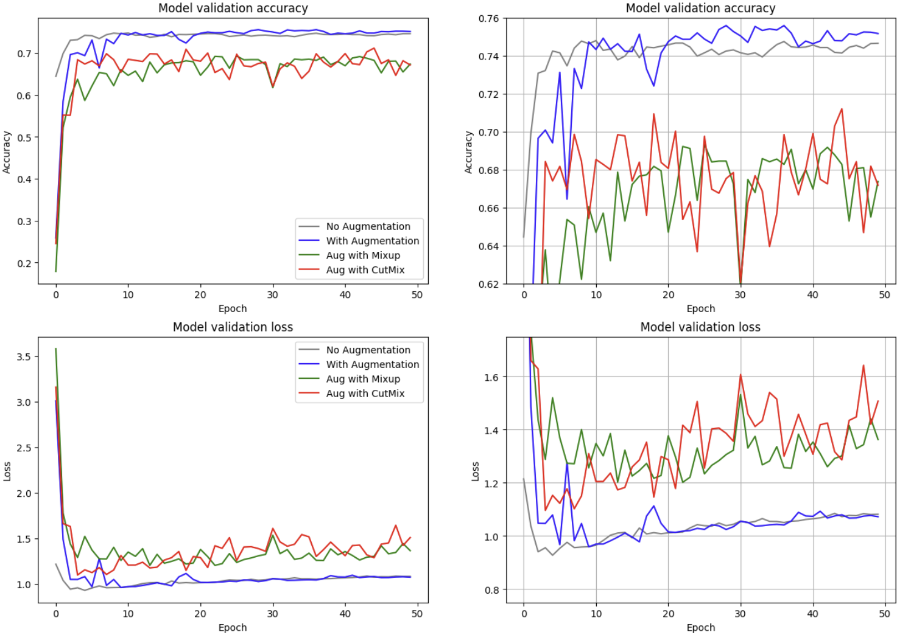
        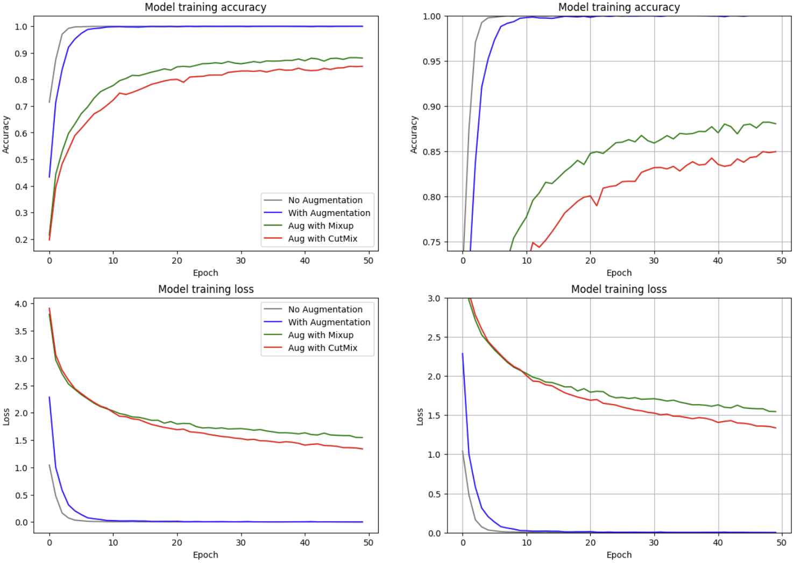
        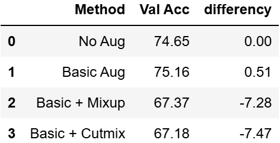
    
- [Ο]  **2. 전체 코드에서 가장 핵심적이거나 가장 복잡하고 이해하기 어려운 부분에 작성된 
주석 또는 doc string을 보고 해당 코드가 잘 이해되었나요?**
    - 해당 코드 블럭을 왜 핵심적이라고 생각하는지 확인
    - 해당 코드 블럭에 doc string/annotation이 달려 있는지 확인
    - 해당 코드의 기능, 존재 이유, 작동 원리 등을 기술했는지 확인
    - 주석을 보고 코드 이해가 잘 되었는지 확인
        - 중요! 잘 작성되었다고 생각되는 부분을 캡쳐해 근거로 첨부
        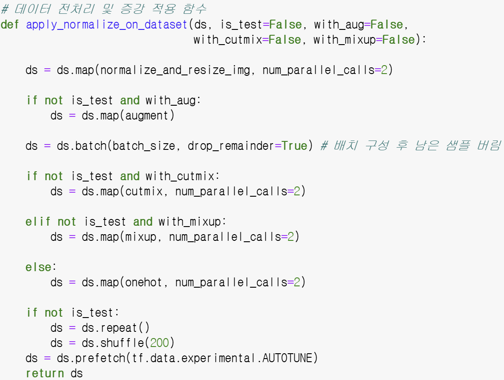
        >CutMix 또는 Mixup 처리를 분리하기 위해 elif문 사용 (전처리 핵심)
        >배치 구성 후 남은 샘플 버림 주석을 보고 처음엔 이해가 되지 않았는데, 내용을 넘어가다 보니 두 데이터셋의 데이터 개수 차이가 원인
        
- [Ο]  **3. 에러가 난 부분을 디버깅하여 문제를 해결한 기록을 남겼거나
새로운 시도 또는 추가 실험을 수행해봤나요?**
    - 문제 원인 및 해결 과정을 잘 기록하였는지 확인
    - 프로젝트 평가 기준에 더해 추가적으로 수행한 나만의 시도, 
    실험이 기록되어 있는지 확인
        - 중요! 잘 작성되었다고 생각되는 부분을 캡쳐해 근거로 첨부
        >실험의 문제를 파악하고 추가 실험을 진행 (Food101)
        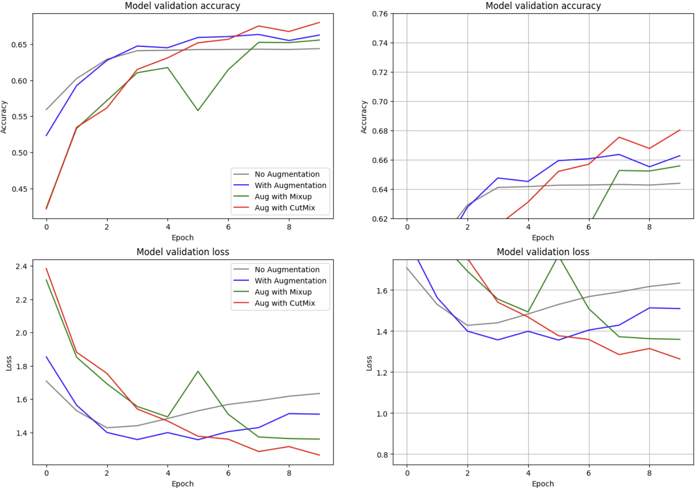
        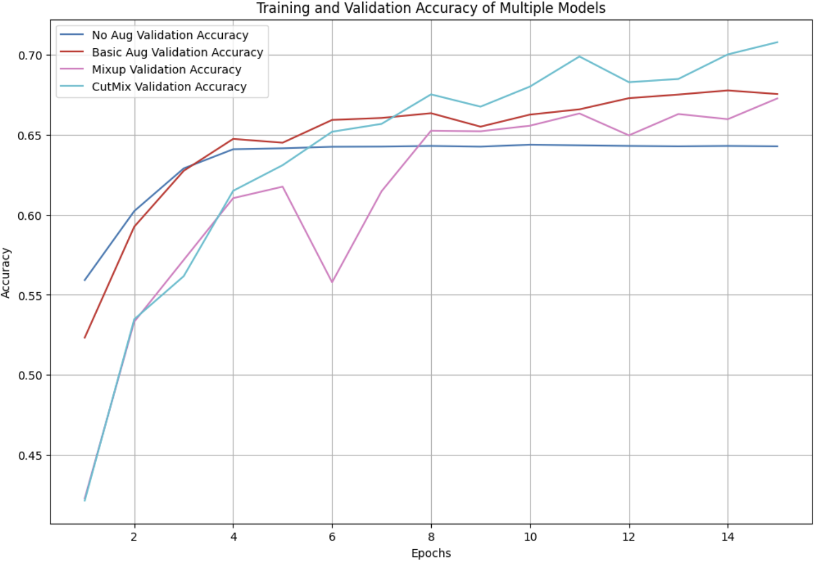
        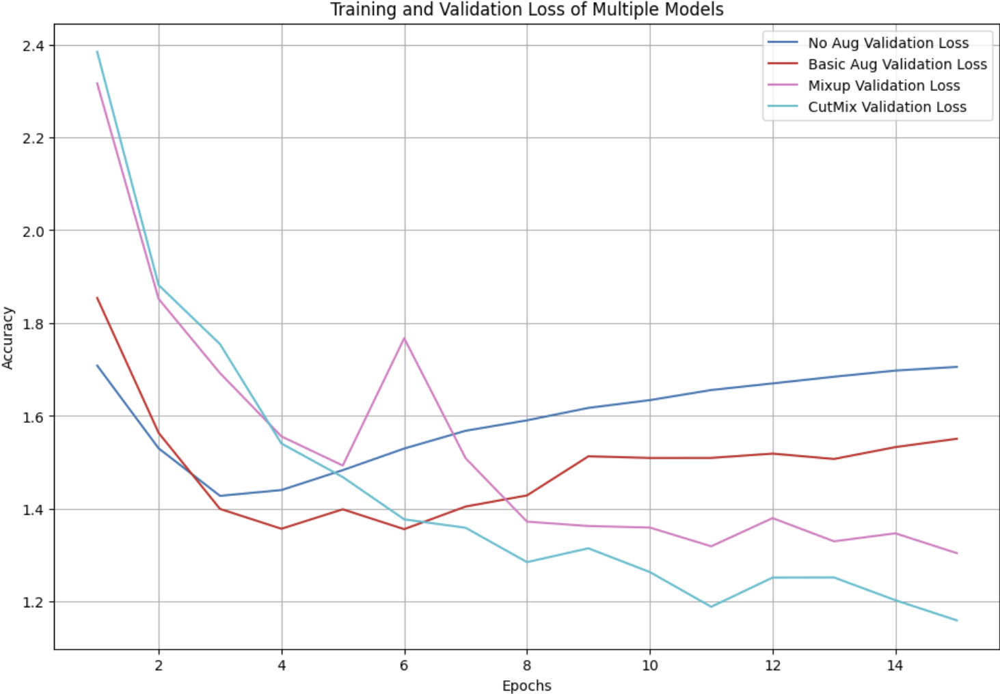
        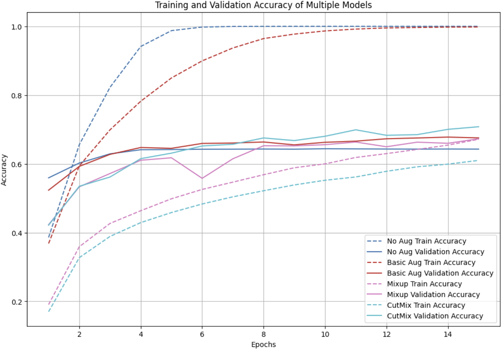
        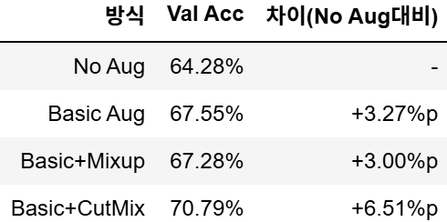
        >성공적인 결과로 이어져 완벽한 기승전결을 보여주심
        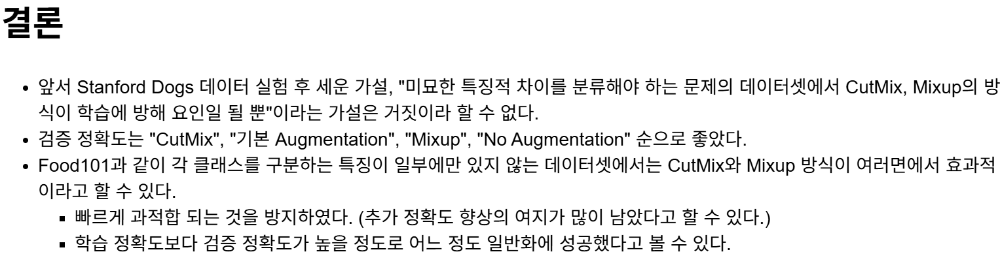
        
- [Ο]  **4. 회고를 잘 작성했나요?**
    - 주어진 문제를 해결하는 완성된 코드 내지 프로젝트 결과물에 대해
    배운점과 아쉬운점, 느낀점 등이 기록되어 있는지 확인
    - 전체 코드 실행 플로우를 그래프로 그려서 이해를 돕고 있는지 확인
        - 중요! 잘 작성되었다고 생각되는 부분을 캡쳐해 근거로 첨부
        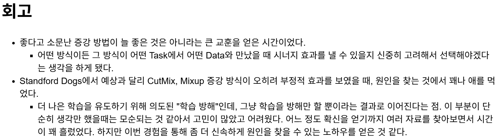
        
- [Ο]  **5. 코드가 간결하고 효율적인가요?**
    - 파이썬 스타일 가이드 (PEP8) 를 준수하였는지 확인
    - 코드 중복을 최소화하고 범용적으로 사용할 수 있도록 함수화/모듈화했는지 확인
        - 중요! 잘 작성되었다고 생각되는 부분을 캡쳐해 근거로 첨부
        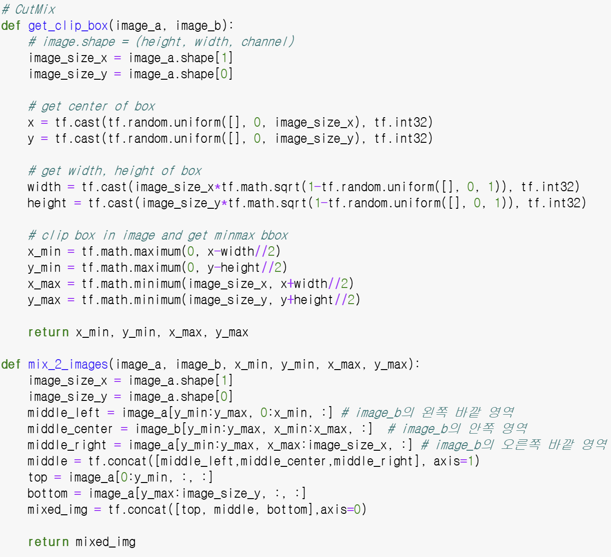
        >필요한 부분에 있어 주석 존재
        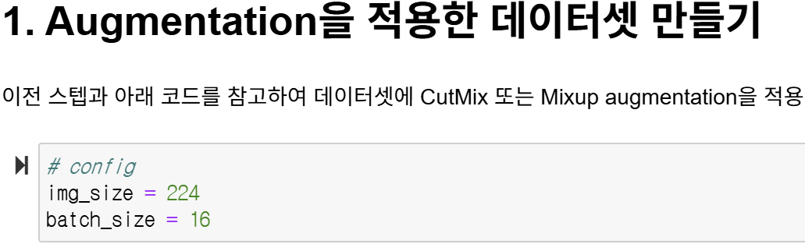
        >매개변수 값을 config로 전역화시켜 편이성 향상


# 회고(참고 링크 및 코드 개선)
```
# 의도 파악이 잘 전달 됐을 정도로 리뷰가 좋았음 (이제까지 들었던 리뷰 중 최고, 1st)
# 잘된 경우에 대한 시각화를 맞추기 위해, 비교가 되는 학습의 epoch를 15로 같게 맞춰주셨으면 비교해서 보기 편할 것 같음
# 모델 학습 문제 원인에 대해 파악하는 방법에 대해 어느정도 알고 있어야 할 필요성을 느꼈음 (ex. CAM)
```