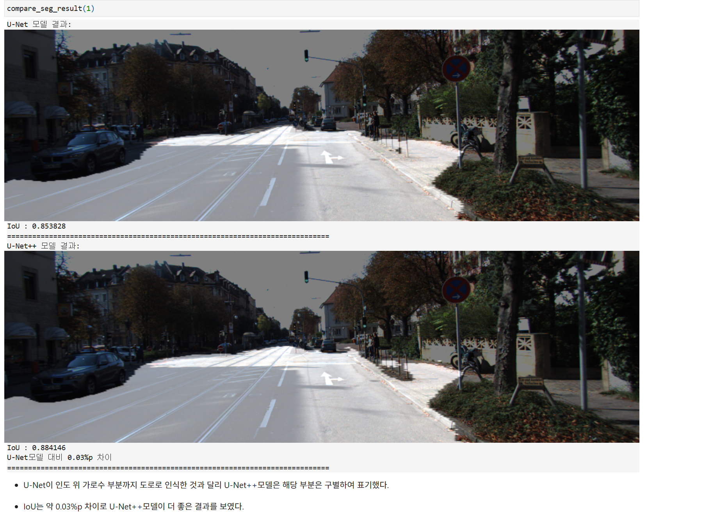
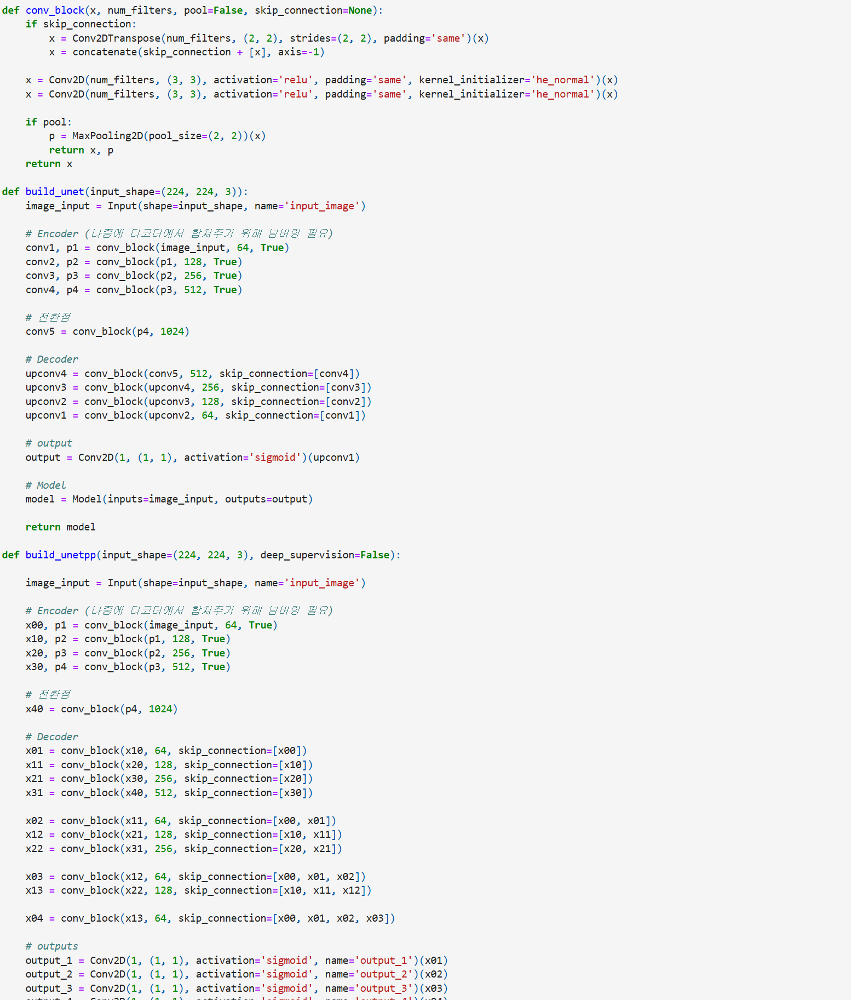
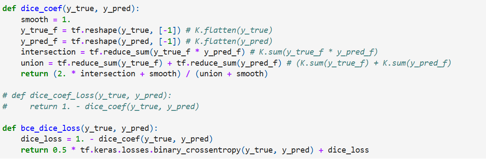
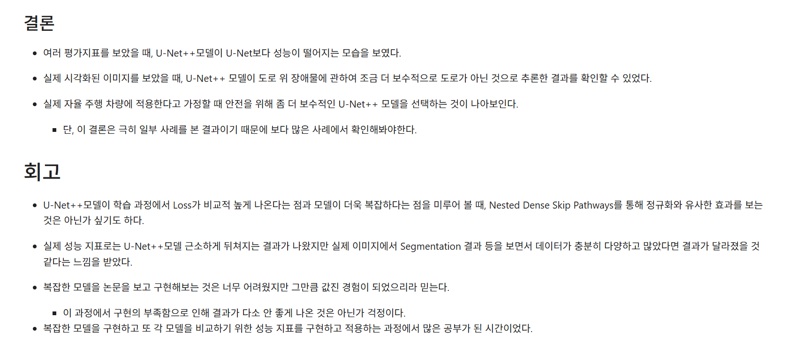
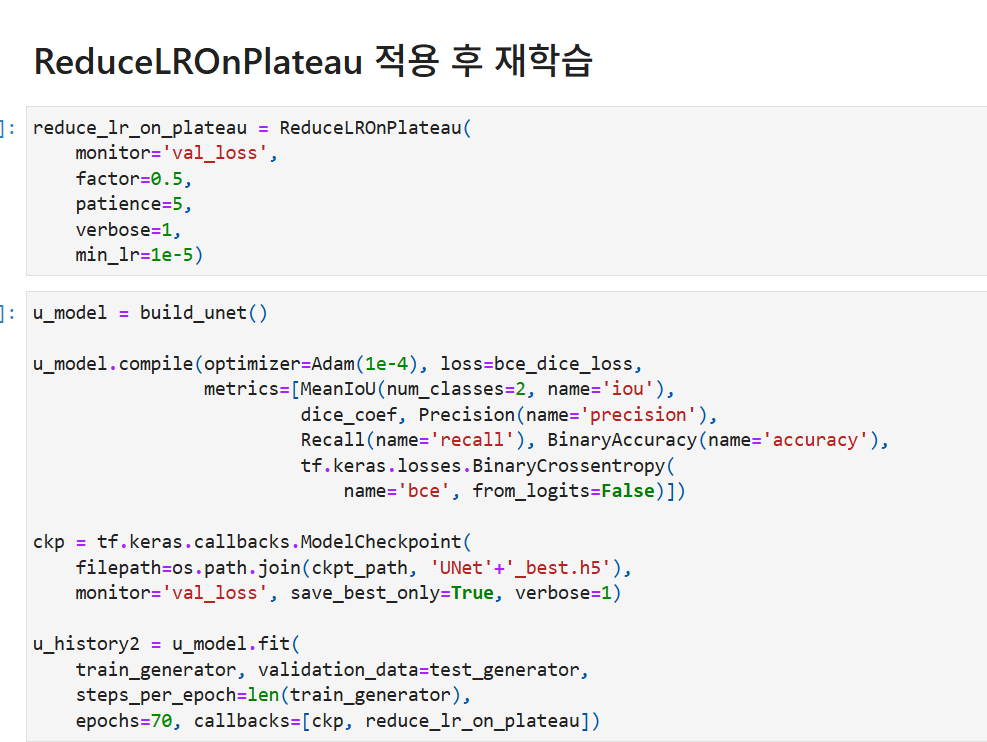

# AIFFEL Campus Online Code Peer Review Templete
- 코더 : 김성훈
- 리뷰어 : 김현진


# PRT(Peer Review Template)
- [x]  **1. 주어진 문제를 해결하는 완성된 코드가 제출되었나요?**
    - 문제에서 요구하는 최종 결과물이 첨부되었는지 확인
        - 중요! 해당 조건을 만족하는 부분을 캡쳐해 근거로 첨부
        
        u-net++을 구축하고 u-net과 비교해서 평가하는 부분까지 문제를 잘 해결하셨습니다.
    
- [x]  **2. 전체 코드에서 가장 핵심적이거나 가장 복잡하고 이해하기 어려운 부분에 작성된 
주석 또는 doc string을 보고 해당 코드가 잘 이해되었나요?**
    - 해당 코드 블럭을 왜 핵심적이라고 생각하는지 확인
    - 해당 코드 블럭에 doc string/annotation이 달려 있는지 확인
    - 해당 코드의 기능, 존재 이유, 작동 원리 등을 기술했는지 확인
    - 주석을 보고 코드 이해가 잘 되었는지 확인
        - 중요! 잘 작성되었다고 생각되는 부분을 캡쳐해 근거로 첨부
        
        u-net++를 구현할떄 deep_supervision을 사용하여 진행한 부분이 u-net모델과의 차이점을 더 늘려주는 효과를 가져올 것이라 기대를 하며 코드를 봤습니다.결론적으로는 테스트데이터가 많이 없어 차이를 많이 보지는 못했지만 일정부분은 차이가 있다는 것을 확인을 했습니다.
- [x]  **3. 에러가 난 부분을 디버깅하여 문제를 해결한 기록을 남겼거나
새로운 시도 또는 추가 실험을 수행해봤나요?**
    - 문제 원인 및 해결 과정을 잘 기록하였는지 확인
    - 프로젝트 평가 기준에 더해 추가적으로 수행한 나만의 시도, 
    실험이 기록되어 있는지 확인
        - 중요! 잘 작성되었다고 생각되는 부분을 캡쳐해 근거로 첨부
        
        dice를 메트릭으로 활용하여 2개의 모델을 평가하였다.다른 메트릭보다 dice를 사용하여 측정한 것이 좋아 보였다.인상적인 시도로 보였습니다.

        
- [x]  **4. 회고를 잘 작성했나요?**
    - 주어진 문제를 해결하는 완성된 코드 내지 프로젝트 결과물에 대해
    배운점과 아쉬운점, 느낀점 등이 기록되어 있는지 확인
    - 전체 코드 실행 플로우를 그래프로 그려서 이해를 돕고 있는지 확인
        - 중요! 잘 작성되었다고 생각되는 부분을 캡쳐해 근거로 첨부
        
        u-net과 u-net++에 대한 성능을 정량과 정성적인 측면에서 각각 분석을 하고 어떤 모델이 더 좋은지,
        추가적으로 필요한 것들은 무엇인지 회고를 잘 작성하였습니다.
        
- [x]  **5. 코드가 간결하고 효율적인가요?**
    - 파이썬 스타일 가이드 (PEP8) 를 준수하였는지 확인
    - 코드 중복을 최소화하고 범용적으로 사용할 수 있도록 함수화/모듈화했는지 확인
        - 중요! 잘 작성되었다고 생각되는 부분을 캡쳐해 근거로 첨부
        
        모든 코드를 일일이 분석하며 보지는 못했으나,대부분의 코드들이 함수화/모듈화가 진행되어 잘 작성되었습니다.

# 회고(참고 링크 및 코드 개선)
```
테스트데이터를 추가적으로 진행하고 dice를 메트릭으로 정하는것과,추가적으로 여려가지 실험들을 진행하셔서 u-net과 u-net++ 모델에 대해 정량적,정성적인 측면 두부분에 대해 자세히 볼 수 있어서 좋았습니다.
한가지 아쉬운 점은 u-net과 u-net++에서 왜 u-net++가 성능이 떨어지는지에 대해서는 구체적인 이유를 근거로 평가까지 추가된다면 휼륭한 리뷰가 될 것같습니다.
```